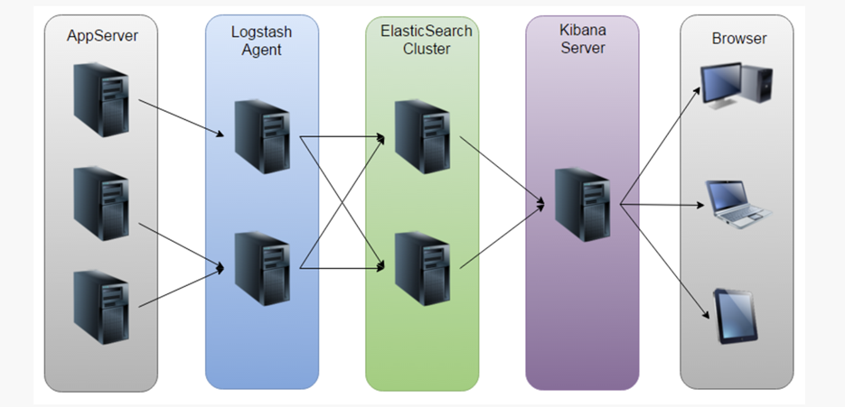
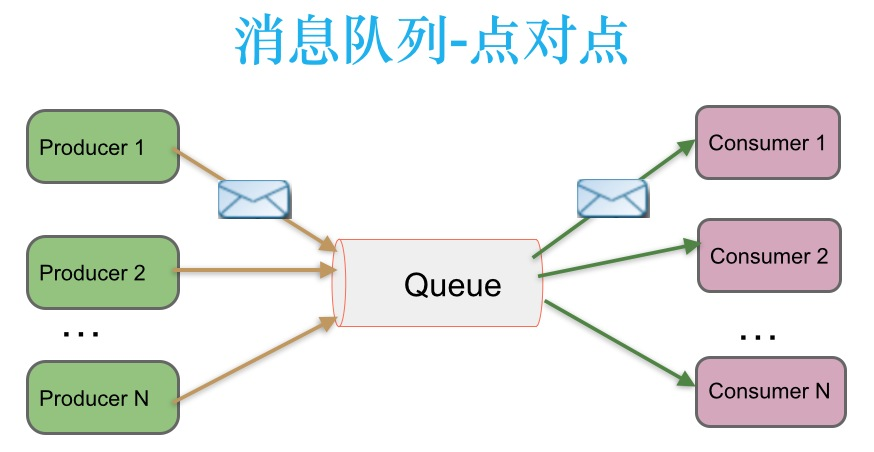
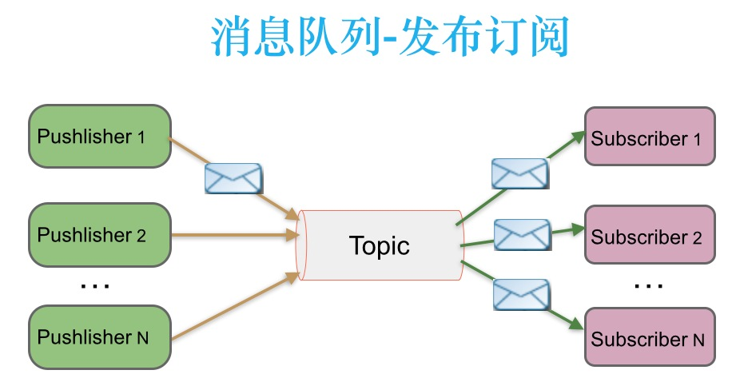
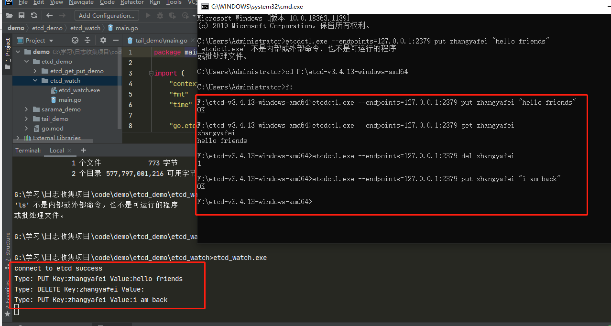
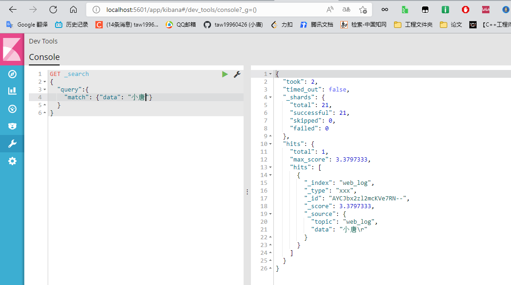

## 0、项目地址

### 1.完整项目的GitHub地址

```c

```

### 2.csdn地址

```c

```

## 一、日志收集系统背景

### 1. 项目背景

- a. 每个系统都有日志，当系统出现问题时，需要通过日志解决问题
- b. 当系统机器比较少时，登陆到服务器上查看即可满足
- c. 当系统机器规模巨大，登陆到机器上查看几乎不现实

### 2. 解决方案

- a. 把机器上的日志实时收集，统一的存储到中心系统
- b. 然后再对这些日志建立索引，通过搜索即可以找到对应日志
- c. 通过提供界面友好的web界面，通过web即可以完成日志搜索

### 3. 遇到的问题

- a. 实时日志量非常大，每天几十亿条
- b. 日志准实时收集，延迟控制在分钟级别
- c. 能够水平可扩展

### 4. 业界方案ELK



### 5. ELK方案问题

- a. 运维成本高，每增加一个日志收集，都需要手动修改配置
- b. 监控缺失，无法准确获取logstash的状态
- c. 无法做定制化开发以及维护

## 二、日志收集系统架构

### 1. 日志收集系统设计


### 2. 各组件介绍

- Log Agent，日志收集客户端，用来收集服务器上的日志
- Kafka，高吞吐量的分布式队列，linkin开发，apache顶级开源项目
- ES，elasticsearch，开源的搜索引擎，提供基于http restful的web接口
- Kibaa：开源的ES数据分析和可视化工具
- Hadoop，分布式计算框架，能够对大量数据进行分布式处理的平台
- Storm：一个免费并开源的分布式实时计算系统

### 3. 技能概述

- 服务端agent开发
- 后端服务组件开发
- etcd的使用
- Kafka和zookeeper的使用
- ES和Kibana的使用

### 4. 消息队列的通信模型

#### 4.1 点对点模式（queue）



​        消息生产者生产消息发送到queue中，然后消息消费者从queue中取出并且消费消息。一条消息被消费以后，queue中就没有了，不存在重复消费。

#### 4.2 发布/订阅（topic）



​    消息生产者（发布）将消息发布到topic中，同时有多个消息消费者（订阅）消费该消息。和点对点不同，发布到topic的消息会被所有订阅者消费（类似于关注了微信公众号的人都能收到推送的文章）。

补充：发布订阅模式下，当发布者消息量很大时，显然单个订阅者的处理能力是不足的。实际上现实场景中是多个订阅者节点组成一个订阅组负载均衡消费topic消息即分组订阅，这样订阅者很容易实现消费能力线性扩展。可以看成是一个topic下有多个Queue，每个Queue是点对点的方式，Queue之间是发布订阅方式。

### 5. Kafka

#### 5.1 介绍

​       Apache Kafka由著名职业社交公司LinkedLn开发，最初是被设计用来解决Linkedln公司内部海量日志传输问题。kafka使用Scala语言编写，于2011年开源并进入Apache孵化器，2012年10月正式毕业，现在为Apache顶级项目。       

​       Kafka是一个分布式数据流平台，可以运行在单台服务器上，也可以在多台服务器上部署形成集群。它提供了发布和订阅功能，使用者可以发送数据到Kafka中，也可以从Kafka中读取数据（以便进行后续的处理）。Kafka具有高吞吐、低延迟、高容错等特点。设计内在就是分布式的，分区的和可复制的提交日志服务。


#### 5.2 架构组件

- Producer: Producer即生产者，消息的产生着，是消息的入口，用来向Kafka中发送数据（record）。
- kafka cluster: kafka集群，一台或多台服务器组成
  - **Broker**：Broker是指部署了kafka实例的服务器节点，每个服务器上有一个或多个kafka的实例，我们姑且恩威每个broker对应一台服务器。每个kafka集群内的broker都有一个不重复的编号，如图中的broker-0、broker-1等。
  - **Topic**：消息的主题，可以理解为消息的分类，用来区分不同类型信息的主题。kafka的数据就保存在topi。在每个broker上都可以创建多个topic。实际应用中通常是一个业务线建一个topic。比如应用程序A订阅了主题t1，应用程序B订阅了主题t2而没有订阅t1，那么发送到主题t1中的数据将只能被应用程序A读到，而不会被应用程序B读到。
  - **Partition**：Topic的分区，每个topic可以有一个或多个partition（分区），分区的作用是负载，提高kafka的吞吐量。同一个topic在不同的分区的数据是不重复的，partition的表现形式就是一个一个的文件夹。Kafka使用分区支持物理上的并发写入和读取，从而大大提高了吞吐量。
  - **Replication**:  每一个分区都有多个副本，副本的作用是做备胎。当主分区（Leader）故障的时候会选择一个备胎（Follower)上位，成为Leader。在kafka中默认副本的最大数量是10个，且副本的数量不能大于Broker的数量，follower和leader绝对是在不同的机器，同一机器对同一分区也只能存放一个副本（包括自己）
- **Record** 消息
  实际写入Kafka中并可以被读取的消息记录。每个record包含了key、value和timestamp。
- **Consumer**：消费者，即消息的消费方，是消息的出口，用来读取Kafka中的数据（record）。
  - **Consumer Group**：消费组，一个消费者组可以包含一个或多个消费者。在kafka的设计中同一个分区的数据只能被消费者组中的某一个消费者消费。同一个消费者组的消费者可以消费同一个topic的不同分区的数据，使用多分区+多消费者方式可以极大提高数据下载的处理速度。
- **Segment**：消息的聚合单位，包括一定的消息数量。

#### 5.3 工作流程

我们看上面的架构图中，producer就是生产者，是数据的入口。Producer在写入数据的时候**永远的找leader**，不会直接将数据写入follower！那leader怎么找呢？写入的流程又是什么样的呢？看下图。


1. 生产者从kafka集群中获取分区Leader信息

2. 生产者将消息发送给leader
3. leader将消息写入本地磁盘
4. follower从leader拉取消息数据
5. follower将消息写入本地磁盘后向leader发送ACK
6. leader收到所有的follower的ACK后向生产者发送ACK


#### 5.4 选择partition的原则

​     在kafka中，如果某个topic有多个partion，producer又怎么知道该将数据发往哪个partition呢？kafka中与几个原则：

1. partition在写入的时候可以指定需要写入的partition，如果有指定，则写入对应的partition。
2. 如果没有指定partition，但是设置了数据的key，则会根据key的值hash出一个partition。
3. 如果既没指定partition，有没有设置key，则会采用轮询方式，即每次取一小段时间的数据写入某个partiton，下一小段的时间写入下一个partition。

#### 5.5 ACK应答机制

​      producer在想kafka写入消息的时候，可以设置参数来确定是否确认kafka接收到数据，这个参数可设置为0、1、all。

- 0代表producer往集群发送数据不需要等到集群的返回，不确保消息发送成功。安全性最低但是效率最高。
- 1代表producer往集群发送数据只要leader应答就可以发送下一条，只确保leader发送成功。
- all代表producer往集群发送数据需要所有的follower都完成从leader的同步才会发送下一条，确保leader发送成功和所有的副本都完成备份。安全性最高，但是效率最低。

​       最后要注意的是，如果往不存在的topic写数据，能不能写入成功呢？kafka会自动创建topic，分区和副本的数量根据默认配置都是1。

#### 5.6 Topic和数据日志

​       topic是同一类别的消息记录（record）的集合。在Kafka中，一个主题通常有多个订阅者。对于每个主题，Kafka集群维护了一个分区数据日志文件结构如下：


​       每个partition都是一个有序并且不可变的消息记录集合。当新的数据写入时，就被追加到partition的末尾。在每个partition中，每条消息都会被分配一个顺序的唯一标识，这个标识被称为offset，即偏移量。注意，Kafka只保证在同一个partition内部消息是有序的，在不同partition之间，并不能保证消息有序。

​       Kafka可以配置一个保留期限，用来标识日志会在Kafka集群内保留多长时间。Kafka集群会保留在保留期限内所有被发布的消息，不管这些消息是否被消费过。比如保留期限设置为两天，那么数据被发布到Kafka集群的两天以内，所有的这些数据都可以被消费。当超过两天，这些数据将会被清空，以便为后续的数据腾出空间。由于Kafka会将数据进行持久化存储（即写入到硬盘上），所以保留的数据大小可以设置为一个比较大的值。

#### 5.7 Partition结构

​     Partition在服务器上的表现形式就是一个一个的文件夹，每个partition的文件夹下面会有多组segment文件，魅族segment文件又包含.index文件、.log文件、.timeindex文件三个文件，其中.log文件就是实际存储message的地方，而.index和.timeindex文件为索引文件，用于检索消息。

#### 5.8 消费数据

​       多个消费者实例可以组成一个消费者组，并用一个标签来标识这个消费者组。一个消费者组中的不同消费者实例可以运行在不同的进程甚至不同的服务器上。

​      如果所有的消费者实例都在同一个消费者组中，那么消息记录会被很好的均衡的发送到每个消费者实例。

​      如果所有的消费者实例都在不同的消费者组，那么每一条消息记录会被广播到每一个消费者实例。

​       举个例子。如上图所示，一个两个节点的Kafka集群上拥有一个四个partition（P0-P3）的topic。有两个消费者组都在消费这个topic中的数据，消费者组A有两个消费者实例，消费者组B有四个消费者实例。从图中我们可以看到，在同一个消费者组中，每个消费者实例可以消费多个分区，但是每个分区最多只能被消费者组中的一个实例消费。也就是说，如果有一个4个分区的主题，那么消费者组中最多只能有4个消费者实例去消费，多出来的都不会被分配到分区。其实这也很好理解，如果允许两个消费者实例同时消费同一个分区，那么就无法记录这个分区被这个消费者组消费的offset了。如果在消费者组中动态的上线或下线消费者，那么Kafka集群会自动调整分区与消费者实例间的对应关系。

#### 5.9 使用场景

**消息队列（MQ）**

在系统架构设计中，经常会使用消息队列（Message Queue）——MQ。MQ是一种跨进程的通信机制，用于上下游的消息传递，使用MQ可以使上下游解耦，消息发送上游只需要依赖MQ，逻辑上和物理上都不需要依赖其他下游服务。MQ的常见使用场景如流量削峰、数据驱动的任务依赖等等。在MQ领域，除了Kafka外还有传统的消息队列如ActiveMQ和RabbitMQ等。

**追踪网站活动**

Kafka最出就是被设计用来进行网站活动（比如PV、UV、搜索记录等）的追踪。可以将不同的活动放入不同的主题，供后续的实时计算、实时监控等程序使用，也可以将数据导入到数据仓库中进行后续的离线处理和生成报表等。

**Metrics**

Kafka经常被用来传输监控数据。主要用来聚合分布式应用程序的统计数据，将数据集中后进行统一的分析和展示等。

**日志聚合**

很多人使用Kafka作为日志聚合的解决方案。日志聚合通常指将不同服务器上的日志收集起来并放入一个日志中心，比如一台文件服务器或者HDFS中的一个目录，供后续进行分析处理。相比于Flume和Scribe等日志聚合工具，Kafka具有更出色的性能。

#### 5.10 优点

- 可靠性 - Kafka是分布式，分区，复制和容错的。
- 可扩展性 - Kafka消息传递系统轻松缩放，无需停机。
- 耐用性 - Kafka使用分布式提交日志，这意味着消息会尽可能快地保留在磁盘上，因此它是持久的。
- 性能 - Kafka对于发布和订阅消息都具有高吞吐量。 即使存储了许多TB的消息，它也保持稳定的性能。
- Kafka非常快，并保证零停机和零数据丢失。

#### 5.11 kafka为什么快？

Kafka的消息是保存或缓存在磁盘上的，一般认为在磁盘上读写数据是会降低性能的，因为寻址会比较消耗时间，但是实际上，Kafka的特性之一就是高吞吐率。

即使是普通的服务器，Kafka也可以轻松支持每秒百万级的写入请求，超过了大部分的消息中间件，这种特性也使得Kafka在日志处理等海量数据场景广泛应用。

Kafka速度的秘诀在于，它把所有的消息都变成一个批量的文件，并且进行合理的批量压缩，减少网络IO损耗，通过mmap提高I/O速度，写入数据的时候由于单个Partion是末尾添加所以速度最优；读取数据的时候配合sendfile直接暴力输出。

详细介绍参考：https://www.cnblogs.com/binyue/p/10308754.html

### 6. Zookeeper

Zookeeper是一个分布式的，开放源码的分布式应用程序协调服务，是Google的Chubby一个开源的实现，它是集群的管理者，监视者集群中各个节点的状态，根据节点提交的反馈进行下一步合理操作。最终，将简单易用的接口和性能高校、功能稳定的系统提供给用户。

ZooKeeper主要包含几下几个组件：

- Client（客户端）：我们的分布式应用集群中的一个节点，从服务器访问信息。对于特定的时间间隔，每个客户端向服务器发送消息以使服务器知道客户端是活跃的。类似地，当客户端连接时，服务器发送确认码。如果连接的服务器没有响应，客户端会自动将消息重定向到另一个服务器。
- Server（服务器）：服务器，我们的ZooKeeper总体中的一个节点，为客户端提供所有的服务。向客户端发送确认码以告知服务器是活跃的。
- Ensemble：ZooKeeper服务器组。形成ensemble所需的最小节点数为3。
- Leader： 服务器节点，如果任何连接的节点失败，则执行自动恢复。Leader在服务启动时被选举。
- Follower：跟随leader指令的服务器节点。

**ZooKeeper的应用场景：**

**服务注册&服务发现**

**配置中心**


- 分布式锁
  Zookeeper是强一致的多个客户端同时在Zookeeper上创建相同znode，只有一个创建成功

## 三、日志收集系统环境搭建

### 1. JDK的下载与安装

- 安装文件：http://www.oracle.com/technetwork/java/javase/downloads/index.html 下载JDK
- jdk镜像：https://repo.huaweicloud.com/java/jdk/ 
- 安装完成后需要添加以下的环境变量（右键点击“我的电脑” -> "高级系统设置" -> "环境变量" ）：
  - JAVA_HOME: F:\jdk11 (jdk的安装路径)
  - Path: 在现有的值后面添加"; %JAVA_HOME%\bin"

- 打开cmd运行 "java -version" 查看当前系统Java的版本：


### 2. 安装ZOOKEEPER

Kafka的运行依赖于Zookeeper，所以在运行Kafka之前我们需要安装并运行Zookeeper，安装zookeeper有两种方式，由于Kafka 0.5.x版本以上已经自带ZooKeper，不需要自己安装ZooKeeper。所以可以使用kafka自带的zoopeeper，也可以自己单独安装。下面介绍单独安装方式：

- 下载安装文件：http://www.apache.org/dyn/closer.cgi/zookeeper/

- 解压文件 

- 打开zookeeper文件夹的conf目录，把zoo_sample.cfg重命名成zoo.cfg

- 从文本编辑器里打开zoo.cfg

- 把dataDir的值改成zoopeeper的文件夹目录下的data（zoopeeper数据存放地址）

- 添加如下系统变量：

  ​	ZOOKEEPER_HOME: zookeeper目录

  ​	Path: 在现有的值后面添加 ";%ZOOKEEPER_HOME%\bin;"

- 运行Zookeeper: 打开cmd然后执行 zkserver

### 3. 安装KAFKA

- 进入kafka的配置目录，编辑server.properties文件，修改log.dirs=XXX（XXX表示kafka日志路径），zookeeper.connect=XXX（默认是localhost：2181，如修改了上一步的Zookeeper的端口，需要在这里修改）

- **kafka会自动默认使用9092端口，如需变动，可以修改listeners=PLAINTEXT://:XXXX（将XXXX换成变动后的端口）**

- 打开kafka目录，进入**bin/windows**目录下，shift+鼠标右键选择打开命令窗口（也可以直接通过cmd **cd 文件目录**的方式进入）

  ```sh
  # 启动zoopeeper
  bin\windows\zookeeper-server-start.bat .\config\zookeeper.properties
  # 启动kafka
  bin\windows\kafka-server-start.bat .\config\server.properties
  ```

  

  

  

  

## 四、LogAgent

类似于在`linux`下通过`tail`的方法读日志文件，将读取的内容发给`kafka`，这里的`tailf`是可以动态变化的，当配置文件发生变化时，可以通知我们程序自动增加需要增加的配置文件。`tailf`去获取相应的日志并发给`kafka producer`。主要包含`kafka`、`tailf`和`configlog`。

`LogAgent`工作流程

- 读日志--`tailf`第三方库
- 在`kafka`写日志 --`sarama`第三方库
- 读取配置文件 -- `"gopkg.in/ini.v1"`

### 1. tail

- 下载

  ```go
  "github.com/hpcloud/tail"
  ```

- 使用示例

  ```go
  package main
  
  import (
  	"fmt"
  	"github.com/hpcloud/tail"
  	"time"
  )
  
  func main() {
  	fileName := "./my.log"
  	config := tail.Config{
  		ReOpen:    true,                                 // 重新打开
  		Follow:    true,                                 // 是否跟随
  		Location:  &tail.SeekInfo{Offset: 0, Whence: 2}, // 从文件的哪个地方开始读
  		MustExist: false,                                // 文件不存在不报错
  		Poll:      true,
  	}
  	tails, err := tail.TailFile(fileName, config)
  	if err != nil {
  		fmt.Println("tail file failed, err:", err)
  		return
  	}
  	var (
  		line *tail.Line
  		ok   bool
  	)
  	for {
  		line, ok = <-tails.Lines//遍历chan，读取日志内容
  		if !ok {
  			fmt.Printf("tail file close reopen, filename:%s\n", tails.Filename)
  			time.Sleep(time.Second)
  			continue
  		}
  		fmt.Println("line:", line.Text)
  	}
  }
  ```

- 使用说明

  1. 首先初始化配置结构体config
  2. 调用`TailFile`函数，并传入文件路径和config，返回有个tail的结构体，tail结构体的Lines字段封装了拿到的信息
  3. 遍历`tail.Lnes`字段，取出信息（注意这里要循环的取，因为tail可以实现实时监控）

- 运行

  

  

### 2. sarama

- 下载

  ```go
  go get github.com/Shopify/sarama
  ```

- 生产消息示例

  ```go
  package main
  
  import (
  	"fmt"
  	"github.com/Shopify/sarama"
  )
  
  func main() {
  	config := sarama.NewConfig()
  	config.Producer.RequiredAcks = sarama.WaitForAll          // 发送完数据需要leader和follow都确认
  	config.Producer.Partitioner = sarama.NewRandomPartitioner // 新选出一个partition
  	config.Producer.Return.Successes = true                   // 成功交付的消息将在success channel返回
  
  	// 构造一个消息
  	msg := &sarama.ProducerMessage{}
  	msg.Topic = "web_log"
  	msg.Value = sarama.StringEncoder("this is a test log")
  	// 连接kafka
  	client, err := sarama.NewSyncProducer([]string{"127.0.0.1:9092"}, config)
  	if err != nil {
  		fmt.Println("producer closed, err:", err)
  		return
  	}
  	fmt.Println("kafka 连接成功！")
  	defer client.Close()
  	// 发送消息
  	pid, offset, err := client.SendMessage(msg)
  	if err != nil {
  		fmt.Println("send msg failed, err:", err)
  		return
  	}
  	fmt.Printf("pid:%v offset:%v\n", pid, offset)
  	print("发送成功！")
  }
  ```

- 运行

  

- `kafka`文件数据

  

  

- 消费示例

  ```go
  package main
  
  import (
  	"fmt"
  	"github.com/Shopify/sarama"
  )
  
  // kafka consumer
  
  func main() {
  	consumer, err := sarama.NewConsumer([]string{"127.0.0.1:9092"}, nil)
  	if err != nil {
  		fmt.Printf("fail to start consumer, err:%v\n", err)
  		return
  	}
  	partitionList, err := consumer.Partitions("web_log") // 根据topic取到所有的分区
  	if err != nil {
  		fmt.Printf("fail to get list of partition:err%v\n", err)
  		return
  	}
  	fmt.Println("分区: ", partitionList)
  	for partition := range partitionList { // 遍历所有的分区
  		// 针对每个分区创建一个对应的分区消费者
  		pc, err := consumer.ConsumePartition("web_log", int32(partition), sarama.OffsetNewest)
  		if err != nil {
  			fmt.Printf("failed to start consumer for partition %d,err:%v\n", partition, err)
  			return
  		}
  		defer pc.AsyncClose()
  		// 异步从每个分区消费信息
  		go func(sarama.PartitionConsumer) {
  			for msg := range pc.Messages() {
  				fmt.Printf("Partition:%d Offset:%d Key:%s Value:%s\n", msg.Partition, msg.Offset, msg.Key, msg.Value)
  			}
  		}(pc)
  	}
  	select {}
  }
  ```

### 3. 简易版LogAgent

- 项目结构

  ```go
  │  go.mod
  │  go.sum
  │  main.go
  │  my.log
  ├─conf
  │      config.go
  │      config.ini
  │
  ├─kafka
  │      kafka.go
  │
  └─taillog
         taillog.go
  
  ```

- `conf/config.ini`：配置文件

  ```ini
  [kafka]
  address=127.0.0.1:9092
  topic=web_log
  
  [taillog]
  filename=./my.log
  ```

- `conf/config.go`：设置读取配置文件的结构体

  ```go
  package conf
  
  type Config struct {
  	Kafka Kafka `ini:"kafka"`
  	TailLog TailLog `ini:"taillog"`
  }
  
  
  type Kafka struct {
  	Address string `ini:"address"`
  	Topic string `ini:"topic"`
  }
  
  type TailLog struct {
  	FileName string `ini:"filename"`
  }
  ```

- `kafka/kafka.go`：`kafka`初始化以及将消息写入`kafka`

  ```go
  package kafka
  
  import (
  	"fmt"
  	"github.com/Shopify/sarama"
  )
  // 专门往kafka写日志的模块
  
  var (
  	client sarama.SyncProducer	// 声明一个全局的连接kafka的生产者client
  )
  
  // init初始化client
  func Init(addrs []string) (err error) {
  	config := sarama.NewConfig()
  
  	config.Producer.RequiredAcks = sarama.WaitForAll          // 发送完数据需要leader和follow都确认
  	config.Producer.Partitioner = sarama.NewRandomPartitioner // 新选出⼀个partition
  	config.Producer.Return.Successes = true                   // 成功交付的消息将在success channel返回
  
  	// 连接kafka
  	client, err = sarama.NewSyncProducer(addrs, config)
  	if err != nil {
  		fmt.Println("producer closed, err:", err)
  		return
  	}
  	return
  }
  
  func SendToKafka(topic, data string)  {
  	msg := &sarama.ProducerMessage{}
  	msg.Topic = topic
  	msg.Value = sarama.StringEncoder(data)
  	// 发送到kafka
  	pid, offset, err := client.SendMessage(msg)
  	if err != nil{
  		fmt.Println("sned mage failed, err:", err)
  	}
  	fmt.Printf("pid:%v offset:%v\n", pid, offset)
  	fmt.Println("发送成功")
  }
  ```

- `taillog/taillog.go`：读取日志模块，初始化tail以及监听日志文件读取chan数据

  ```go
  package taillog
  
  import (
  	"fmt"
  	"github.com/hpcloud/tail"
  )
  
  // 专门收集日志的模块
  
  var (
  	tailObj *tail.Tail
  	logChan chan string
  )
  
  func Init(filename string) (err error) {
  	config := tail.Config{
  		ReOpen:    true,
  		Follow:    true,
  		Location:  &tail.SeekInfo{Offset: 0, Whence: 2},
  		MustExist: false,
  		Poll:      true}
  	tailObj, err = tail.TailFile(filename, config)
  	if err != nil {
  		fmt.Println("tail file failed, err:", err)
  		return
  	}
  	return
  }
  
  func ReadChan() <-chan *tail.Line {
  	return tailObj.Lines
  }
  ```

- `main.go`：主函数

  

  - 配置文件版

  ```go
  package main
  
  import (
  	"fmt"
  	"gopkg.in/ini.v1"
  	"logagent/conf"
  	"logagent/kafka"
  	"logagent/taillog"
  	"strings"
  	"time"
  )
  
  var config  = new(conf.Config)
  
  // logAgent 入口程序
  
  func main() {
  	// 0. 加载配置文件
  	//cfg, err := ini.Load("./conf/config.ini")
  	//address := cfg.Section("kafka").Key("address").String()
  	//topic := cfg.Section("kafka").Key("topic").String()
  	//path := cfg.Section("taillog").Key("path").String()
  	err := ini.MapTo(config, "./conf/config.ini")
  	if err != nil {
  		fmt.Printf("Fail to read file: %v", err)
  		return
  	}
  	fmt.Println(config)
  	// 1. 初始化kafka连接
  	err = kafka.Init(strings.Split(config.Kafka.Address, ";"))
  	if err != nil {
  		fmt.Println("init kafka failed, err:%v\n", err)
  		return
  	}
  	fmt.Println("init kafka success.")
  	// 2. 打开日志文件准备收集日志
  	err = taillog.Init(config.TailLog.FileName)
  	if err != nil {
  		fmt.Printf("Init taillog failed,err:%v\n", err)
  		return
  	}
  	fmt.Println("init taillog success.")
  	run()
  }
  
  func run() {
  	// 1. 读取日志
  	for {
  		select {
  		case line := <-taillog.ReadChan():
  			// 2. 发送到kafka
  			kafka.SendToKafka(config.Kafka.Topic, line.Text)
  		default:
  			time.Sleep(time.Second)
  		}
  	}
  }
  ```

- `kafka`终端打开消费者程序，进入`kafka`安装目录

```sh
bin\windows\kafka-console-consumer.bat --bootstrap-server=127.0.0.1:9092 --topic=web_log --from-beginning
```


### 4. etcd

etcd是使用Go语言开发的一个开源、高可用的分布式key-value存储，可以用于配置共享和服务注册和发现，类似的项目有Zookeeper`和`consul`，提供`Restful`的接口，使用简单，基于raft算法的强一致性，高可用的服务存储目录。

#### 4.1 特点

- 完全复制：集群中的每个节点都可以使用完整的存档
- 高可用性：Etcd可用于避免硬件的单点故障或网络问题
- 一致性：每次读取都会返回跨多主机的最新写入
- 简单：包括一个定义良好、面向用户的API（gRPC）
- 快速：每秒10000次写入的基准速度
- 可靠：使用Raft算法实现强一致性、高可用服务存储目录

#### 4.2 应用场景

- 服务发现

  

  服务发现要解决的也是分布式系统中最常见的问题之一，即在同一个分布式集群中的进程或服务，要如何才能找到对方并建立连接。本质上来说，服务发现就是想要了解集群中是否有进程在监听 udp 或 tcp 端口，并且通过名字就可以查找和连接。

- 配置中心(我们实现的日志收集客户端需要用到)

  将一些配置信息放到etcd上进行集中管理。
  这类场景方式通常是这样的：应用在启动到时候主动从etcd获取一次配置信息，同时在etcd节点上注册一个Watcher并等待，以后每次配置有更新的时候，etcd都会实时通知订阅者，以此达到获取最新配置信息的目的。

- 分布式锁

  因为 etcd 使用 Raft 算法保持了数据的强一致性，某次操作存储到集群中的值必然是全局一致的，所以很容易实现分布式锁。锁服务有两种使用方式，一是保持独占，二是控制时序。

  - **保持独占即所有获取锁的用户最终只有一个可以得到**。etcd 为此提供了一套实现分布式锁原子操作 CAS（`CompareAndSwap`）的 API。通过设置`prevExist`值，可以保证在多个节点同时去创建某个目录时，只有一个成功。而创建成功的用户就可以认为是获得了锁。
  - 控制时序，即所有想要获得锁的用户都会被安排执行，但是**获得锁的顺序也是全局唯一的，同时决定了执行顺序**。etcd 为此也提供了一套 API（自动创建有序键），对一个目录建值时指定为`POST`动作，这样 etcd 会自动在目录下生成一个当前最大的值为键，存储这个新的值（客户端编号）。同时还可以使用 API 按顺序列出所有当前目录下的键值。此时这些键的值就是客户端的时序，而这些键中存储的值可以是代表客户端的编号。

  

#### 4.3 etcd架构


从etcd的架构图中我们可以看到，etcd主要分为四个部分。

- HTTP Server： 用于处理用户发送的API请求以及其它etcd节点的同步与心跳信息请求。
- Store：用于处理etcd支持的各类功能的事务，包括数据索引、节点状态变更、监控与反馈、事件处理与执行等等，是etcd对用户提供的大多数API功能的具体实现。
- Raft：Raft强一致性算法的具体实现，是etcd的核心。
- WAL：Write Ahead Log（预写式日志），是etcd的数据存储方式。除了在内存中存有所有数据的状态以及节点的索引以外，etcd就通过WAL进行持久化存储。WAL中，所有的数据提交前都会事先记录日志。Snapshot是为了防止数据过多而进行的状态快照；Entry表示存储的具体日志内容。

通常，一个用户的请求发送过来，会经由HTTP Server转发给Store进行具体的事务处理，如果涉及到节点的修改，则交给Raft模块进行状态的变更、日志的记录，然后再同步给别的etcd节点以确认数据提交，最后进行数据的提交，再次同步。

重要概念：

- Raft：etcd所采用的保证分布式系统强一致性的算法。
- Node：一个Raft状态机实例。
- Member： 一个etcd实例。它管理着一个Node，并且可以为客户端请求提供服务。
- Cluster：由多个Member构成可以协同工作的etcd集群。
- Peer：对同一个etcd集群中另外一个Member的称呼。
- Client： 向etcd集群发送HTTP请求的客户端。
- WAL：预写式日志，etcd用于持久化存储的日志格式。
- snapshot：etcd防止WAL文件过多而设置的快照，存储etcd数据状态。
- Proxy：etcd的一种模式，为etcd集群提供反向代理服务。
- Leader：Raft算法中通过竞选而产生的处理所有数据提交的节点。
- Follower：竞选失败的节点作为Raft中的从属节点，为算法提供强一致性保证。
- Candidate：当Follower超过一定时间接收不到Leader的心跳时转变为Candidate开始竞选。
- Term：某个节点成为Leader到下一次竞选时间，称为一个Term。
- Index：数据项编号。Raft中通过Term和Index来定位数据。

#### 4.3 为什么用 etcd 而不用ZooKeeper？

​	etcd 实现的这些功能，ZooKeeper都能实现。那么为什么要用 etcd 而非直接使用ZooKeeper呢？

- 为什么不选择ZooKeeper？

1. 部署维护复杂，其使用的`Paxos`强一致性算法复杂难懂。官方只提供了`Java`和`C`两种语言的接口。
2. 使用`Java`编写引入大量的依赖。运维人员维护起来比较麻烦。
3. 最近几年发展缓慢，不如`etcd`和`consul`等后起之秀。

- 为什么选择etcd？

1. 简单。使用 Go 语言编写部署简单；支持HTTP/JSON API,使用简单；使用 Raft 算法保证强一致性让用户易于理解。
2. etcd 默认数据一更新就进行持久化。
3. etcd 支持 SSL 客户端安全认证。

​       最后，etcd 作为一个年轻的项目，正在高速迭代和开发中，这既是一个优点，也是一个缺点。优点是它的未来具有无限的可能性，缺点是无法得到大项目长时间使用的检验。然而，目前 `CoreOS`、`Kubernetes`和`CloudFoundry`等知名项目均在生产环境中使用了`etcd`，所以总的来说，etcd值得你去尝试。

#### 4.4 raft协议

- 核心要点
  - Leader选举（Leader Election）
  - 日志同步 （Log Replication）
    - leader收到client的更新请求后，会将更新的内容同步给所有follower。
  - 集群状态的正确性 （Safety）
    - 保证日志的一致性
    - 保证选举的正确性
- zookeeper的zad协议的区别
- 参考：https://www.cnblogs.com/zhangyafei/p/13926838.html

- etcd的watch
  - etcd底层如何实现watch给客户发通知(websocket)

#### 4.5 etcd的下载和安装

- 下载

  ```
  https://github.com/coreos/etcd/releases
  ```

  

  选择对应版本的下载即可，下载之后解压

  

- etcd启动

  双击etcd.exe运行

  

- etcd客户端

  ```sh
  etcdctl.exe --endpoints=127.0.0.1:2379 put zhangyafei "hahaha"
  ```

  

#### 4.6 go操作etcd

- 下载

  ```go
  go get "go.etcd.io/etcd/clientv3"
  ```

  注：若安装过程中报undefined: balancer.PickOptions类似错误，原始为grpc版本不兼容，需要修改go.mod

  ```go
  replace google.golang.org/grpc => google.golang.org/grpc v1.26.0
  ```

- put和get

  ```go
  package main
  
  import (
  	"context"
  	"fmt"
  	"time"
  
  	"go.etcd.io/etcd/clientv3"
  )
  
  func main() {
  	// etcd client put/get demo
  	// use etcd/clientv3
  	cli, err := clientv3.New(clientv3.Config{
  		Endpoints:   []string{"127.0.0.1:2379"},
  		DialTimeout: 5 * time.Second,
  	})
  	if err != nil {
  		// handle error!
  		fmt.Printf("connect to etcd failed, err:%v\n", err)
  		return
  	}
  	fmt.Println("connect to etcd success")
  	defer cli.Close()
  	// put
  	ctx, cancel := context.WithTimeout(context.Background(), time.Second)
  	_, err = cli.Put(ctx, "zhangyafei", "dsb")
  	cancel()
  	if err != nil {
  		fmt.Printf("put to etcd failed, err:%v\n", err)
  		return
  	}
  	// get
  	ctx, cancel = context.WithTimeout(context.Background(), time.Second)
  	resp, err := cli.Get(ctx, "zhangyafei")
  	cancel()
  	if err != nil {
  		fmt.Printf("get from etcd failed, err:%v\n", err)
  		return
  	}
  	for _, ev := range resp.Kvs {
  		fmt.Printf("%s:%s\n", ev.Key, ev.Value)
  	}
  }
  ```

  

- watch

  ```go
  package main
  
  import (
  	"context"
  	"fmt"
  	"time"
  
  	"go.etcd.io/etcd/clientv3"
  )
  
  // watch demo
  
  func main() {
  	cli, err := clientv3.New(clientv3.Config{
  		Endpoints:   []string{"127.0.0.1:2379"},
  		DialTimeout: 5 * time.Second,
  	})
  	if err != nil {
  		fmt.Printf("connect to etcd failed, err:%v\n", err)
  		return
  	}
  	fmt.Println("connect to etcd success")
  	defer cli.Close()
  	// watch key:q1mi change
  	// 派一个哨兵 一直监视着 zhangyafei这个key的变化（新增 删除 修改））
  	rch := cli.Watch(context.Background(), "zhangyafei") // <-chan WatchResponse
  	// 从通道尝试取值（监视的信息）
  	for wresp := range rch {
  		for _, ev := range wresp.Events {
  			fmt.Printf("Type: %s Key:%s Value:%s\n", ev.Type, ev.Kv.Key, ev.Kv.Value)
  		}
  	}
  }
  ```

  我们在etcd目录终端输入以下命令，可以查看、新增、删除key
  
  ```sh
  etcdctl.exe --endpoints=http://127.0.0.1:2379 put zhangyafei "hello"
  etcdctl.exe --endpoints=http://127.0.0.1:2379 get zhangyafei
  etcdctl.exe --endpoints=http://127.0.0.1:2379 del zhangyafei
  ```
  
  

- lease租约

  ```go
  package main
   
  import (
      "fmt"
      "time"
  )
   
  // etcd lease
   
  import (
      "context"
      "log"
   
      "go.etcd.io/etcd/clientv3"
  )
   
  func main() {
      cli, err := clientv3.New(clientv3.Config{
          Endpoints:   []string{"127.0.0.1:2379"},
          DialTimeout: time.Second * 5,
      })
      if err != nil {
          log.Fatal(err)
      }
      fmt.Println("connect to etcd success.")
      defer cli.Close()
   
      // 创建一个5秒的租约
      resp, err := cli.Grant(context.TODO(), 5)
      if err != nil {
          log.Fatal(err)
      }
   
      // 5秒钟之后, /nazha/ 这个key就会被移除
      _, err = cli.Put(context.TODO(), "/nazha/", "dsb", clientv3.WithLease(resp.ID))
      if err != nil {
          log.Fatal(err)
      }
  }
  ```

- keepAlive

  ```go
  package main
   
  import (
      "context"
      "fmt"
      "log"
      "time"
   
      "go.etcd.io/etcd/clientv3"
  )
   
  // etcd keepAlive
   
  func main() {
      cli, err := clientv3.New(clientv3.Config{
          Endpoints:   []string{"127.0.0.1:2379"},
          DialTimeout: time.Second * 5,
      })
      if err != nil {
          log.Fatal(err)
      }
      fmt.Println("connect to etcd success.")
      defer cli.Close()
   
      resp, err := cli.Grant(context.TODO(), 5)
      if err != nil {
          log.Fatal(err)
      }
   
      _, err = cli.Put(context.TODO(), "/nazha/", "dsb", clientv3.WithLease(resp.ID))
      if err != nil {
          log.Fatal(err)
      }
   
      // the key 'foo' will be kept forever
      ch, kaerr := cli.KeepAlive(context.TODO(), resp.ID)
      if kaerr != nil {
          log.Fatal(kaerr)
      }
      for {
          ka := <-ch
          fmt.Println("ttl:", ka.TTL)
      }
  }
  ```

- 基于etcd实现分布式锁

  下载

  ```go
  import "go.etcd.io/etcd/clientv3/concurrency"
  ```

  `go.etcd.io/etcd/clientv3/concurrency`在etcd之上实现并发操作，如分布式锁、屏障和选举。

  示例

  ```go
  cli, err := clientv3.New(clientv3.Config{Endpoints: endpoints})
  if err != nil {
      log.Fatal(err)
  }
  defer cli.Close()
   
  // 创建两个单独的会话用来演示锁竞争
  s1, err := concurrency.NewSession(cli)
  if err != nil {
      log.Fatal(err)
  }
  defer s1.Close()
  m1 := concurrency.NewMutex(s1, "/my-lock/")
   
  s2, err := concurrency.NewSession(cli)
  if err != nil {
      log.Fatal(err)
  }
  defer s2.Close()
  m2 := concurrency.NewMutex(s2, "/my-lock/")
   
  // 会话s1获取锁
  if err := m1.Lock(context.TODO()); err != nil {
      log.Fatal(err)
  }
  fmt.Println("acquired lock for s1")
   
  m2Locked := make(chan struct{})
  go func() {
      defer close(m2Locked)
      // 等待直到会话s1释放了/my-lock/的锁
      if err := m2.Lock(context.TODO()); err != nil {
          log.Fatal(err)
      }
  }()
   
  if err := m1.Unlock(context.TODO()); err != nil {
      log.Fatal(err)
  }
  fmt.Println("released lock for s1")
   
  <-m2Locked
  fmt.Println("acquired lock for s2")
  ```

  输出

  ```go
  acquired lock for s1
  released lock for s1
  acquired lock for s2
  ```

- 官方文档：https://godoc.org/go.etcd.io/etcd/clientv3

#### 4.7 etcd 集群

etcd 作为一个高可用键值存储系统，天生就是为集群化而设计的。由于 Raft 算法在做决策时需要多数节点的投票，所以 etcd 一般部署集群推荐奇数个节点，推荐的数量为 3、5 或者 7 个节点构成一个集群。

搭建一个3节点集群示例：

在每个etcd节点指定集群成员，为了区分不同的集群最好同时配置一个独一无二的token。

下面是提前定义好的集群信息，其中`n1`、`n2`和`n3`表示3个不同的etcd节点。

```sh
TOKEN=token-01
CLUSTER_STATE=new
CLUSTER=n1=http://10.240.0.17:2380,n2=http://10.240.0.18:2380,n3=http://10.240.0.19:2380
```

在`n1`这台机器上执行以下命令来启动etcd：

```sh
etcd --data-dir=data.etcd --name n1 \
    --initial-advertise-peer-urls http://10.240.0.17:2380 --listen-peer-urls http://10.240.0.17:2380 \
    --advertise-client-urls http://10.240.0.17:2379 --listen-client-urls http://10.240.0.17:2379 \
    --initial-cluster ${CLUSTER} \
    --initial-cluster-state ${CLUSTER_STATE} --initial-cluster-token ${TOKEN}
```

在`n2`这台机器上执行以下命令启动etcd：

```sh
etcd --data-dir=data.etcd --name n2 \
    --initial-advertise-peer-urls http://10.240.0.18:2380 --listen-peer-urls http://10.240.0.18:2380 \
    --advertise-client-urls http://10.240.0.18:2379 --listen-client-urls http://10.240.0.18:2379 \
    --initial-cluster ${CLUSTER} \
    --initial-cluster-state ${CLUSTER_STATE} --initial-cluster-token ${TOKEN}
```

在`n3`这台机器上执行以下命令启动etcd：

```sh
etcd --data-dir=data.etcd --name n3 \
    --initial-advertise-peer-urls http://10.240.0.19:2380 --listen-peer-urls http://10.240.0.19:2380 \
    --advertise-client-urls http://10.240.0.19:2379 --listen-client-urls http://10.240.0.19:2379 \
    --initial-cluster ${CLUSTER} \
    --initial-cluster-state ${CLUSTER_STATE} --initial-cluster-token ${TOKEN}
```

etcd 官网提供了一个可以公网访问的 etcd 存储地址。你可以通过如下命令得到 etcd 服务的目录，并把它作为`-discovery`参数使用。

```sh
curl https://discovery.etcd.io/new?size=3
https://discovery.etcd.io/a81b5818e67a6ea83e9d4daea5ecbc92
 
# grab this token
TOKEN=token-01
CLUSTER_STATE=new
DISCOVERY=https://discovery.etcd.io/a81b5818e67a6ea83e9d4daea5ecbc92
 
 
etcd --data-dir=data.etcd --name n1 \
    --initial-advertise-peer-urls http://10.240.0.17:2380 --listen-peer-urls http://10.240.0.17:2380 \
    --advertise-client-urls http://10.240.0.17:2379 --listen-client-urls http://10.240.0.17:2379 \
    --discovery ${DISCOVERY} \
    --initial-cluster-state ${CLUSTER_STATE} --initial-cluster-token ${TOKEN}
 
 
etcd --data-dir=data.etcd --name n2 \
    --initial-advertise-peer-urls http://10.240.0.18:2380 --listen-peer-urls http://10.240.0.18:2380 \
    --advertise-client-urls http://10.240.0.18:2379 --listen-client-urls http://10.240.0.18:2379 \
    --discovery ${DISCOVERY} \
    --initial-cluster-state ${CLUSTER_STATE} --initial-cluster-token ${TOKEN}
 
 
etcd --data-dir=data.etcd --name n3 \
    --initial-advertise-peer-urls http://10.240.0.19:2380 --listen-peer-urls http://10.240.0.19:2380 \
    --advertise-client-urls http://10.240.0.19:2379 --listen-client-urls http:/10.240.0.19:2379 \
    --discovery ${DISCOVERY} \
    --initial-cluster-state ${CLUSTER_STATE} --initial-cluster-token ${TOKEN}
```

到此etcd集群就搭建起来了，可以使用`etcdctl`来连接etcd。

```sh
export ETCDCTL_API=3
HOST_1=10.240.0.17
HOST_2=10.240.0.18
HOST_3=10.240.0.19
ENDPOINTS=$HOST_1:2379,$HOST_2:2379,$HOST_3:2379
 
etcdctl --endpoints=$ENDPOINTS member lis
```

### 5. logagent从etcd加载收集项配置

- 配置

  ```sh
  value := `[{"path":"c:/nginx/nginx.log","topic":"web_log"},{"path":"d:/redis/redis.log","topic":"redis_log"},{"path":"e:/mysql/mysql.log","topic":"mysql_log"}]`
  ```

- 将配置信息发送到etcd

  
  
  

- etcd读取配置

  

- `logagent`从`etcd`加载收集项配置

  `conf/config.ini`

  ```ini
  [kafka]
  address=127.0.0.1:9092
  
  [etcd]
  address=127.0.0.1:2379
  timeout=5
  collect_log_key=/logagent/collect_config
  ```

  `conf/config.go`

  ```go
  package conf
  
  type Config struct {
  	Kafka Kafka `ini:"kafka"`
  	Etcd  Etcd  `ini:"etcd"`
  }
  
  type Kafka struct {
  	Address string `ini:"address"`
  	//Topic string `ini:"topic"`
  }
  
  type Etcd struct {
  	Address string `ini:"address"`
  	Key     string `ini:"collect_log_key"`
  	Timeout int    `ini:"timeout"`
  }
  ```

  `etcd/etcd.go`

  ```go
  package etcd
  
  import (
  	"context"
  	"encoding/json"
  	"fmt"
  	"go.etcd.io/etcd/clientv3"
  	"strings"
  	"time"
  )
  
  var (
  	cli *clientv3.Client
  )
  
  type LogEntry struct {
  	Path string `json:"path"`	// 日志存放的路径
  	Topic string `json:"topic"`	 // 日志发往kafka中的哪个Topic
  }
  
  // 初始化etcd的函数
  
  func Init(addr string, timeout time.Duration) (err error) {
  	cli, err = clientv3.New(clientv3.Config{
  		Endpoints: strings.Split(addr, ";"),
  		DialTimeout: timeout,
  	})
  	return
  }
  
  // 从etcd中获取日志收集项的配置信息
  func GetConf(key string) (logEntryConf []*LogEntry, err error) {
  	ctx, cancel := context.WithTimeout(context.Background(), time.Second)
  	resp, err := cli.Get(ctx, key)
  	cancel()
  	if err != nil {
  		fmt.Printf("get from etcd failed, err:%v\n", err)
  		return
  	}
  	for _, ev := range resp.Kvs {
  		//fmt.Printf("%s:%s\n", ev.Key, ev.Value)
  		err = json.Unmarshal(ev.Value, &logEntryConf)
  		if err != nil {
  			fmt.Printf("unmarshal etcd value failed,err:%v\n", err)
  			return
  		}
  	}
  	return
  }
  ```

  `main.go`

  ```go
  package main
  
  import (
  	"fmt"
  	"gopkg.in/ini.v1"
  	"logagent/conf"
  	"logagent/etcd"
  	"logagent/kafka"
  	"strings"
  	"time"
  )
  
  var config  = new(conf.Config)
  
  // logAgent 入口程序
  
  func main() {
  	// 0. 加载配置文件
  	err := ini.MapTo(config, "./conf/config.ini")
  	if err != nil {
  		fmt.Printf("Fail to read file: %v", err)
  		return
  	}
  	// 1. 初始化kafka连接
  	err = kafka.Init(strings.Split(config.Kafka.Address, ";"))
  	if err != nil {
  		fmt.Println("init kafka failed, err:%v\n", err)
  		return
  	}
  	fmt.Println("init kafka success.")
  
  	// 2. 初始化etcd
  	err = etcd.Init(config.Etcd.Address, time.Duration(config.Etcd.Timeout) * time.Second)
  	if err != nil {
  		fmt.Printf("init etcd failed,err:%v\n", err)
  		return
  	}
  	fmt.Println("init etcd success.")
  	// 2.1 从etcd中获取日志收集项的配置信息
  	logEntryConf, err := etcd.GetConf(config.Etcd.Key)
  	// 2,.2 派一个哨兵
  	if err != nil {
  		fmt.Printf("etcd.GetConf failed, err:%v\n", err)
  		return
  	}
  	fmt.Printf("get conf from etcd success, %v\n", logEntryConf)
  	for index, value := range logEntryConf{
  		fmt.Printf("index:%v value:%v\n", index, value)
  	}
  }
  ```

  

### 6. 基于etcd对logagent进行优化

- 实现功能
  - `logagent`根据etcd的配置创建多个tailtask
  - `logagent`实现watch新配置
  - `logagent`实现新增收集任务
  - `logagent`删除新配置中没有的那个任务
  - `logagent`根据IP拉取自己的配置

- `config/config.ini`

  ```ini
  [kafka]
  address=127.0.0.1:9092
  chan_max_size=100000
  
  [etcd]
  address=127.0.0.1:2379
  timeout=5
  collect_log_key=/logagent/%s/collect_config
  ```

- `config/config.go`

  ```go
  package conf
  
  type Config struct {
  	Kafka Kafka `ini:"kafka"`
  	Etcd  Etcd  `ini:"etcd"`
  }
  
  type Kafka struct {
  	Address string `ini:"address"`
  	ChanMaxSize int `ini:"chan_max_zise"`
  }
  
  type Etcd struct {
  	Address string `ini:"address"`
  	Key     string `ini:"collect_log_key"`
  	Timeout int    `ini:"timeout"`
  }
  ```

- `main.go`

  ```go
  package main
  
  import (
  	"fmt"
  	"gopkg.in/ini.v1"
  	"logagent/conf"
  	"logagent/etcd"
  	"logagent/kafka"
  	"logagent/taillog"
  	"logagent/tools"
  	"strings"
  	"sync"
  	"time"
  )
  
  var config  = new(conf.Config)
  
  // logAgent 入口程序
  
  func main() {
  	// 0. 加载配置文件
  	err := ini.MapTo(config, "./conf/config.ini")
  	if err != nil {
  		fmt.Printf("Fail to read file: %v", err)
  		return
  	}
  	// 1. 初始化kafka连接
  	err = kafka.Init(strings.Split(config.Kafka.Address, ";"), config.Kafka.ChanMaxSize)
  	if err != nil {
  		fmt.Println("init kafka failed, err:%v\n", err)
  		return
  	}
  	fmt.Println("init kafka success.")
  
  	// 2. 初始化etcd
  	err = etcd.Init(config.Etcd.Address, time.Duration(config.Etcd.Timeout) * time.Second)
  	if err != nil {
  		fmt.Printf("init etcd failed,err:%v\n", err)
  		return
  	}
  	fmt.Println("init etcd success.")
  	// 实现每个logagent都拉取自己独有的配置，所以要以自己的IP地址实现热加载
  	ip, err := tools.GetOurboundIP()
  	if err != nil {
  		panic(err)
  	}
  	etcdConfKey := fmt.Sprintf(config.Etcd.Key, ip)
  	// 2.1 从etcd中获取日志收集项的配置信息
  	logEntryConf, err := etcd.GetConf(etcdConfKey)
  	if err != nil {
  		fmt.Printf("etcd.GetConf failed, err:%v\n", err)
  		return
  	}
  	fmt.Printf("get conf from etcd success, %v\n", logEntryConf)
  
  	// 2.2 派一个哨兵 一直监视着 zhangyafei这个key的变化（新增 删除 修改））
  	for index, value := range logEntryConf{
  		fmt.Printf("index:%v value:%v\n", index, value)
  	}
  	// 3. 收集日志发往kafka
  	taillog.Init(logEntryConf)
  
  	var wg sync.WaitGroup
  	wg.Add(1)
  	go etcd.WatchConf(etcdConfKey, taillog.NewConfChan())  // 哨兵发现最新的配置信息会通知上面的通道
  	wg.Wait()
  }
  ```

- `kafka/kafka.go`

  ```go
  package kafka
  
  import (
  	"fmt"
  	"github.com/Shopify/sarama"
  )
  // 专门往kafka写日志的模块
  
  type LogData struct {
  	topic string
  	data string
  }
  
  var (
  	client sarama.SyncProducer	// 声明一个全局的连接kafka的生产者client
  	logDataChan chan *LogData
  )
  
  // init初始化client
  func Init(addrs []string, chanMaxSize int) (err error) {
  	config := sarama.NewConfig()
  
  	config.Producer.RequiredAcks = sarama.WaitForAll          // 发送完数据需要leader和follow都确认
  	config.Producer.Partitioner = sarama.NewRandomPartitioner // 新选出⼀个partition
  	config.Producer.Return.Successes = true                   // 成功交付的消息将在success channel返回
  
  	// 连接kafka
  	client, err = sarama.NewSyncProducer(addrs, config)
  	if err != nil {
  		fmt.Println("producer closed, err:", err)
  		return
  	}
  	// 初始化logDataChan
  	logDataChan = make(chan *LogData, chanMaxSize)
  	// 开启后台的goroutine，从通道中取数据发往kafka
  	go SendToKafka()
  	return
  }
  
  // 给外部暴露的一个函数，噶函数只把日志数据发送到一个内部的channel中
  func SendToChan(topic, data string)  {
  	msg := &LogData{
  		topic: topic,
  		data:  data,
  	}
  	logDataChan <- msg
  }
  
  // 真正往kafka发送日志的函数
  func SendToKafka()  {
  	for  {
  		select {
  		case log_data := <- logDataChan:
  			// 构造一个消息
  			msg := &sarama.ProducerMessage{}
  			msg.Topic = log_data.topic
  			msg.Value = sarama.StringEncoder(log_data.data)
  			// 发送到kafka
  			pid, offset, err := client.SendMessage(msg)
  			if err != nil{
  				fmt.Println("sned msg failed, err:", err)
  			}
  			fmt.Printf("send msg success, pid:%v offset:%v\n", pid, offset)
  			//fmt.Println("发送成功")
  		}
  	}
  
  }
  ```

- `etcd/etcd.go`

  ```go
  package etcd
  
  import (
  	"context"
  	"encoding/json"
  	"fmt"
  	"go.etcd.io/etcd/clientv3"
  	"strings"
  	"time"
  )
  
  var (
  	cli *clientv3.Client
  )
  
  type LogEntry struct {
  	Path string `json:"path"`	// 日志存放的路径
  	Topic string `json:"topic"`	 // 日志发往kafka中的哪个Topic
  }
  
  // 初始化etcd的函数
  
  func Init(addr string, timeout time.Duration) (err error) {
  	cli, err = clientv3.New(clientv3.Config{
  		Endpoints: strings.Split(addr, ";"),
  		DialTimeout: timeout,
  	})
  	return
  }
  
  // 从etcd中获取日志收集项的配置信息
  func GetConf(key string) (logEntryConf []*LogEntry, err error) {
  	ctx, cancel := context.WithTimeout(context.Background(), time.Second)
  	resp, err := cli.Get(ctx, key)
  	cancel()
  	if err != nil {
  		fmt.Printf("get from etcd failed, err:%v\n", err)
  		return
  	}
  	for _, ev := range resp.Kvs {
  		//fmt.Printf("%s:%s\n", ev.Key, ev.Value)
  		err = json.Unmarshal(ev.Value, &logEntryConf)
  		if err != nil {
  			fmt.Printf("unmarshal etcd value failed,err:%v\n", err)
  			return
  		}
  	}
  	return
  }
  
  // etcd watch
  func WatchConf(key string, newConfChan chan<- []*LogEntry)  {
  	rch := cli.Watch(context.Background(), key) // <-chan WatchResponse
  	// 从通道尝试取值（监视的信息）
  	for wresp := range rch {
  		for _, ev := range wresp.Events {
  			fmt.Printf("Type: %s Key:%s Value:%s\n", ev.Type, ev.Kv.Key, ev.Kv.Value)
  			//	通知taillog.taskMgr
  			var newConf []*LogEntry
  			//1. 先判断操作的类型
  			if ev.Type != clientv3.EventTypeDelete {
  				// 如果不是是删除操作
  				err := json.Unmarshal(ev.Kv.Value, &newConf)
  				if err != nil {
  					fmt.Printf("unmarshal failed, err:%v\n", err)
  					continue
  				}
  			}
  
  			fmt.Printf("get new conf: %v\n", newConf)
  			newConfChan <- newConf
  			}
  	}
  }
  ```

- `taillog/taillog.go`

  ```go
  package taillog
  
  import (
  	"context"
  	"fmt"
  	"github.com/hpcloud/tail"
  	"logagent/kafka"
  )
  
  // 专门收集日志的模块
  
  
  type TailTask struct {
  	path string
  	topic string
  	instance *tail.Tail
  	// 为了能实现退出r,run()
  	ctx context.Context
  	cancelFunc context.CancelFunc
  }
  
  func NewTailTask(path, topic string) (t *TailTask) {
  	ctx, cancel := context.WithCancel(context.Background())
  	t = &TailTask{
  		path: path,
  		topic: topic,
  		ctx: ctx,
  		cancelFunc: cancel,
  	}
  	err := t.Init()
  	if err != nil {
  		fmt.Println("tail file failed, err:", err)
  	}
  	return
  }
  
  func (t TailTask) Init() (err error) {
  	config := tail.Config{
  		ReOpen:    true,						// 充新打开
  		Follow:    true,						// 是否跟随
  		Location:  &tail.SeekInfo{Offset: 0, Whence: 2},	// 从文件哪个地方开始读
  		MustExist: false,							// 文件不存在不报错
  		Poll:      true}
  	t.instance, err = tail.TailFile(t.path, config)
  	// 当goroutine执行的函数退出的时候,goriutine就退出了
  	go t.run()  // 直接去采集日志发送到kafka
  	return
  }
  
  func (t *TailTask) run()  {
  	for  {
  		select {
  		case <- t.ctx.Done():
  			fmt.Printf("tail task:%s_%s 结束了...\n", t.path, t.topic)
  			return
  		case line :=<- t.instance.Lines:   // 从TailTask的通道中一行一行的读取日志
  			// 3.2 发往kafka
  			fmt.Printf("get log data from %s success, log:%v\n", t.path, line.Text)
  			kafka.SendToChan(t.topic, line.Text)
  		}
  	}
  }
  ```

- `taillog/taillog_mgr`

  ```go
  package taillog
  
  import (
  	"fmt"
  	"logagent/etcd"
  	"time"
  )
  
  var taskMrg *TailLogMgr
  
  type TailLogMgr struct {
  	logEntry []*etcd.LogEntry
  	taskMap map[string]*TailTask
  	newConfChan chan []*etcd.LogEntry
  }
  
  func Init(logEntryConf []*etcd.LogEntry)  {
  	taskMrg = &TailLogMgr{
  		logEntry: logEntryConf,
  		taskMap: make(map[string]*TailTask, 16),
  		newConfChan: make(chan  []*etcd.LogEntry),  // 无缓冲区的通道
  	}
  	for _, logEntry := range logEntryConf{
  		// 3.1 循环每一个日志收集项，创建TailObj
  		// logEntry.Path  要收集的全日志文件的路径
  		// 初始化的时候齐了多少个tailTask 都要记下来，为了后续判断方便
  		tailObj := NewTailTask(logEntry.Path, logEntry.Topic)
  		mk := fmt.Sprintf("%s_%s", logEntry.Path, logEntry.Topic)
  		taskMrg.taskMap[mk] = tailObj
  	}
  	go taskMrg.run()
  }
  
  // 监听自己的newConfChan,有了新的配合过来之后就做对应的处理
  
  func (t *TailLogMgr) run()  {
  	for  {
  		select {
  		case newConf := <- t.newConfChan:
  			// 1. 配置新增
  			for _, conf := range newConf {
  				mk := fmt.Sprintf("%s_%s", conf.Path, conf.Topic)
  				_, ok := t.taskMap[mk]
  				if ok {
  					// 原来就有，不需要操作
  					continue
  				}else {
  					// 新增的
  					tailObj := NewTailTask(conf.Path, conf.Topic)
  					t.taskMap[mk] = tailObj
  				}
  			}
  			// 找出原来t.logEntry有，但是newConf中没有的，删掉
  			for _, c1 := range t.logEntry{  // 循环原来的配置
  				isDelete := true
  				for _, c2 := range newConf{  // 取出新的配置
  					if c2.Path == c1.Path && c2.Topic == c1.Topic {
  						isDelete = false
  						continue
  					}
  				}
  				if isDelete {
  					// 把c1对应的这个tailObj给停掉
  					mk := fmt.Sprintf("%s_%s", c1.Path, c1.Topic)
  					// t.taskNap[mk] ==> tailObj
  					t.taskMap[mk].cancelFunc()
  				}
  			}
  			// 2. 配置删除
  			// 3. 配置变更
  			fmt.Println("新的配置来了！", newConf)
  		default:
  			time.Sleep(time.Second)
  		}
  	}
  }
  
  // 一个函数，向外暴露taskMgr的newConfChan
  func NewConfChan() chan <-[]*etcd.LogEntry {
  	return taskMrg.newConfChan
  }
  ```

- `tools/get_ip`

  ```go
  package tools
  
  import (
  	"net"
  	"strings"
  )
  
  // 获取本地对外IP
  func GetOurboundIP() (ip string, err error)  {
  	conn, err := net.Dial("udp", "8.8.8.8:80")
  	if err != nil {
  		return
  	}
  	defer conn.Close()
  	localAddr := conn.LocalAddr().(*net.UDPAddr)
  	//fmt.Println(localAddr.String())
  	ip = strings.Split(localAddr.IP.String(), ":")[0]
  	return
  }
  ```

  

### 7. 连接kafka进行消费

- 将收集项配置放入etcd

  ```go
  package main
  
  import (
  	"context"
  	"fmt"
  	"net"
  	"strings"
  	"time"
  
  	"go.etcd.io/etcd/clientv3"
  )
  
  // 获取本地对外IP
  func GetOurboundIP() (ip string, err error)  {
  	conn, err := net.Dial("udp", "8.8.8.8:80")
  	if err != nil {
  		return
  	}
  	defer conn.Close()
  	localAddr := conn.LocalAddr().(*net.UDPAddr)
  	fmt.Println(localAddr.String())
  	ip = strings.Split(localAddr.IP.String(), ":")[0]
  	return
  }
  
  func main() {
  	// etcd client put/get demo
  	// use etcd/clientv3
  	cli, err := clientv3.New(clientv3.Config{
  		Endpoints:   []string{"127.0.0.1:2379"},
  		DialTimeout: 5 * time.Second,
  	})
  	if err != nil {
  		// handle error!
  		fmt.Printf("connect to etcd failed, err:%v\n", err)
  		return
  	}
  	fmt.Println("connect to etcd success")
  	defer cli.Close()
  	// put
  	ctx, cancel := context.WithTimeout(context.Background(), time.Second)
  	value := `[{"path":"f:/tmp/nginx.log","topic":"web_log"},{"path":"f:/tmp/redis.log","topic":"redis_log"},{"path":"f:/tmp/mysql.log","topic":"mysql_log"}]`
  	//value := `[{"path":"f:/tmp/nginx.log","topic":"web_log"},{"path":"f:/tmp/redis.log","topic":"redis_log"}]`
  	//_, err = cli.Put(ctx, "zhangyafei", "dsb")
  
  	//初始化key
  	ip, err := GetOurboundIP()
  	if err != nil {
  		panic(err)
  	}
  	log_conf_key := fmt.Sprintf("/logagent/%s/collect_config", ip)
  	_, err = cli.Put(ctx, log_conf_key, value)
  
  	//_, err = cli.Put(ctx, "/logagent/collect_config", value)
  	cancel()
  	if err != nil {
  		fmt.Printf("put to etcd failed, err:%v\n", err)
  		return
  	}
  	// get
  	ctx, cancel = context.WithTimeout(context.Background(), time.Second)
  
  	resp, err := cli.Get(ctx, log_conf_key)
  	//resp, err := cli.Get(ctx, "/logagent/collect_config")
  	cancel()
  	if err != nil {
  		fmt.Printf("get from etcd failed, err:%v\n", err)
  		return
  	}
  	for _, ev := range resp.Kvs {
  		fmt.Printf("%s:%s\n", ev.Key, ev.Value)
  	}
  }
  ```

- 消费者代码

  ```go
  package main
  
  import (
  	"fmt"
  	"github.com/Shopify/sarama"
  )
  
  // kafka consumer
  
  func main() {
  	consumer, err := sarama.NewConsumer([]string{"127.0.0.1:9092"}, nil)
  	if err != nil {
  		fmt.Printf("fail to start consumer, err:%v\n", err)
  		return
  	}
  	partitionList, err := consumer.Partitions("web_log") // 根据topic取到所有的分区
  	if err != nil {
  		fmt.Printf("fail to get list of partition:err%v\n", err)
  		return
  	}
  	fmt.Println("分区: ", partitionList)
  	for partition := range partitionList { // 遍历所有的分区
  		// 针对每个分区创建一个对应的分区消费者
  		pc, err := consumer.ConsumePartition("web_log", int32(partition), sarama.OffsetNewest)
  		if err != nil {
  			fmt.Printf("failed to start consumer for partition %d,err:%v\n", partition, err)
  			return
  		}
  		defer pc.AsyncClose()
  		// 异步从每个分区消费信息
  		go func(sarama.PartitionConsumer) {
  			for msg := range pc.Messages() {
  				fmt.Printf("Partition:%d Offset:%d Key:%s Value:%s\n", msg.Partition, msg.Offset, msg.Key, msg.Value)
  			}
  		}(pc)
  	}
  	select {}
  }
  ```

- 运行步骤

  1. 开启zookeeper
  2. 开启kafka
  3. 开启etcd
  4. 设置收集项配置到etcd
  5. 运行logagent从etcd加载收集项配置，使用taillog监听日志文件内容，将新增的日志内容发往kafka
  6. 连接kafka进行消费
  7. 添加日志内容，观察logagent生产和kafka消费状态

  

## 五、LogTransfer

从kafka里面把日志取出来，写入ES,使用Kibana做可视化展示

### 1. ElasticSearch

#### 1.1 介绍

Elasticsearch（ES）是一个基于Lucene构建的开源、分布式、RESTful接口的全文搜索引擎。Elasticsearch还是一个分布式文档数据库，其中每个字段均可被索引，而且每个字段的数据均可被搜索，ES能够横向扩展至数以百计的服务器存储以及处理PB级的数据。可以在极短的时间内存储、搜索和分析大量的数据。通常作为具有复杂搜索场景情况下的核心发动机。

#### 1.2 Elasticsearch能做什么

1. 当你经营一家网上商店，你可以让你的客户搜索你卖的商品。在这种情况下，你可以使用ElasticSearch来存储你的整个产品目录和库存信息，为客户提供精准搜索，可以为客户推荐相关商品。
2. 当你想收集日志或者交易数据的时候，需要分析和挖掘这些数据，寻找趋势，进行统计，总结，或发现异常。在这种情况下，你可以使用Logstash或者其他工具来进行收集数据，当这引起数据存储到ElasticsSearch中。你可以搜索和汇总这些数据，找到任何你感兴趣的信息。
3. 对于程序员来说，比较有名的案例是GitHub，GitHub的搜索是基于ElasticSearch构建的，在github.com/search页面，你可以搜索项目、用户、issue、pull request，还有代码。共有40~50个索引库，分别用于索引网站需要跟踪的各种数据。虽然只索引项目的主分支（master），但这个数据量依然巨大，包括20亿个索引文档，30TB的索引文件。

#### 1.3 Elasticsearch基本概念

- Near Realtime(NRT) 几乎实时

Elasticsearch是一个几乎实时的搜索平台。意思是，从索引一个文档到这个文档可被搜索只需要一点点的延迟，这个时间一般为毫秒级。

- Cluster 集群

群集是一个或多个节点（服务器）的集合， 这些节点共同保存整个数据，并在所有节点上提供联合索引和搜索功能。一个集群由一个唯一集群ID确定，并指定一个集群名（默认为“elasticsearch”）。该集群名非常重要，因为节点可以通过这个集群名加入群集，一个节点只能是群集的一部分。

确保在不同的环境中不要使用相同的群集名称，否则可能会导致连接错误的群集节点。例如，你可以使用logging-dev、logging-stage、logging-prod分别为开发、阶段产品、生产集群做记录。

- Node节点

节点是单个服务器实例，它是群集的一部分，可以存储数据，并参与群集的索引和搜索功能。就像一个集群，节点的名称默认为一个随机的通用唯一标识符（UUID），确定在启动时分配给该节点。如果不希望默认，可以定义任何节点名。这个名字对管理很重要，目的是要确定你的网络服务器对应于你的ElasticSearch群集节点。

我们可以通过群集名配置节点以连接特定的群集。默认情况下，每个节点设置加入名为“elasticSearch”的集群。这意味着如果你启动多个节点在网络上，假设他们能发现彼此都会自动形成和加入一个名为“elasticsearch”的集群。

在单个群集中，你可以拥有尽可能多的节点。此外，如果“elasticsearch”在同一个网络中，没有其他节点正在运行，从单个节点的默认情况下会形成一个新的单节点名为”elasticsearch”的集群。

- Index索引

索引是具有相似特性的文档集合。例如，可以为客户数据提供索引，为产品目录建立另一个索引，以及为订单数据建立另一个索引。索引由名称（必须全部为小写）标识，该名称用于在对其中的文档执行索引、搜索、更新和删除操作时引用索引。在单个群集中，你可以定义尽可能多的索引。

- Type类型

在索引中，可以定义一个或多个类型。类型是索引的逻辑类别/分区，其语义完全取决于你。一般来说，类型定义为具有公共字段集的文档。例如，假设你运行一个博客平台，并将所有数据存储在一个索引中。在这个索引中，你可以为用户数据定义一种类型，为博客数据定义另一种类型，以及为注释数据定义另一类型。

- Document文档

文档是可以被索引的信息的基本单位。例如，你可以为单个客户提供一个文档，单个产品提供另一个文档，以及单个订单提供另一个文档。本文件的表示形式为JSON（JavaScript Object Notation）格式，这是一种非常普遍的互联网数据交换格式。

在索引/类型中，你可以存储尽可能多的文档。请注意，尽管文档物理驻留在索引中，文档实际上必须索引或分配到索引中的类型。

- Shards & Replicas分片与副本

索引可以存储大量的数据，这些数据可能超过单个节点的硬件限制。例如，十亿个文件占用磁盘空间1TB的单指标可能不适合对单个节点的磁盘或可能太慢服务仅从单个节点的搜索请求。

为了解决这一问题，Elasticsearch提供细分你的指标分成多个块称为分片的能力。当你创建一个索引，你可以简单地定义你想要的分片数量。每个分片本身是一个全功能的、独立的“指数”，可以托管在集群中的任何节点。

Shards分片的重要性主要体现在以下两个特征：**

1. 分片允许你水平拆分或缩放内容的大小
2. 分片允许你分配和并行操作的碎片（可能在多个节点上）从而提高性能/吞吐量 这个机制中的碎片是分布式的以及其文件汇总到搜索请求是完全由ElasticSearch管理，对用户来说是透明的。

在同一个集群网络或云环境上，故障是任何时候都会出现的，拥有一个故障转移机制以防分片和节点因为某些原因离线或消失是非常有用的，并且被强烈推荐。为此，Elasticsearch允许你创建一个或多个拷贝，你的索引分片进入所谓的副本或称作复制品的分片，简称Replicas。

- Replicas的重要性主要体现在以下两个特征：

1. 副本为分片或节点失败提供了高可用性。为此，需要注意的是，一个副本的分片不会分配在同一个节点作为原始的或主分片，副本是从主分片那里复制过来的。
2. 副本允许用户扩展你的搜索量或吞吐量，因为搜索可以在所有副本上并行执行。

#### 1.4 ES基本概念与关系型数据库的比较

|                     ES概念                     |    关系型数据库    |
| :--------------------------------------------: | :----------------: |
|           Index（索引）支持全文检索            | Database（数据库） |
|                  Type（类型）                  |    Table（表）     |
| Document（文档），不同文档可以有不同的字段集合 |   Row（数据行）    |
|                 Field（字段）                  |  Column（数据列）  |
|                Mapping（映射）                 |   Schema（模式）   |

#### 1.5 ES下载及安装

- 下载 

​        访问 Elasticsearch [官网](https://www.elastic.co/cn/downloads/elasticsearch)下载安装包，下载完成之后，解压到指定目录。

​        若下载速度慢，可使用国内镜像，华为云：https://mirrors.huaweicloud.com/elasticsearch

- 安装    

  终端进入ES的解压目录，输入命令

  ```sh
  \bin\elasticsearch.bat
  ```

                      访问127.0.0.1::9200，若成功返回以上信息，则说明安装成功。

#### 1.6 Go操作ES

- 下载

  ```go
  go get github.com/olivere/elastic/v7 注意版本和es一致
  ```

- 示例

  ```go
  package main
  
  import (
  	"context"
  	"fmt"
  	"github.com/olivere/elastic/v7"
  )
  
  // Elasticsearch demo
  
  type Student struct {
  	Name    string `json:"name"`
  	Age     int    `json:"age"`
  	Married bool   `json:"married"`
  }
  
  func main() {
  	// 1, 初始化连接，得到一个client连接
  	client, err := elastic.NewClient(elastic.SetURL("http://127.0.0.1:9200"))
  	if err != nil {
  		// Handle error
  		panic(err)
  	}
  
  	fmt.Println("connect to es success")
  	p1 := Student{Name: "ball", Age: 22, Married: false}
  	put1, err := client.Index().Index("student").Type("go").BodyJson(p1).Do(context.Background())
  	if err != nil {
  		// Handle error
  		panic(err)
  	}
  	fmt.Printf("Indexed user %s to index %s, type %s\n", put1.Id, put1.Index, put1.Type)
  }
  ```

  

- 查询结果

  ```sh
  get 127.0.0.1:9200/student/go/_search
  
  之前添加了两条数据
  post 127.0.0.1:9200/student/go
  {
  	"name": "james",
  	"age": 36,
  	"married": true
  }
  {
  	"name": "kongzi",
  	"age": 9000,
  	"married": true
  }
  ```

  

- 参考文档：https://shimo.im/docs/kXHT89xV3vYxVVvw/ 
- 更多使用请参考：https://godoc.org/github.com/olivere/elastic 

### 2. Kibana

#### 2.1 简介

Kibana是一个开源分析和可视化平台，旨在与Elasticsearch协同工作。您使用Kibana搜索，查看和与存储在Elasticsearch索引中的数据进行交互。您可以轻松地执行高级数据分析，并在各种图表，表格和地图中可视化您的数据。

Kibana使您可以轻松理解大量数据。其简单的基于浏览器的界面使您能够快速创建和共享动态仪表板，实时显示Elasticsearch查询的更改。

设置Kibana非常容易。您可以安装Kibana并在几分钟内开始探索您的Elasticsearch索引 - 无需代码，无需额外的基础架构。

#### 2.2 下载

- 版本要求

  应将Kibana和Elasticsearch配置为相同版本的，这是官方推荐的配置。

  不支持Kibana和Elasticsearch运行在不同主要版本（例如Kibana 5.x和Elasticsearch 2.x），也不支持比Elasticsearch版本更新的Kibana次要版本（例如Kibana 5.1和Elasticsearch 5.0）。

  运行高于Kibana的次要版本的Elasticsearch通常可以用于促进首先升级Elasticsearch的升级过程（例如Kibana 5.0和Elasticsearch 5.1）。在此配置中，将在Kibana服务器启动时记录警告，因此在Kibana升级到与Elasticsearch相同的版本之前，它只是暂时的。

  通常支持Kibana和Elasticsearch运行在不同补丁版本（例如Kibana 5.0.0和Elasticsearch 5.0.1），但我们鼓励用户将Kibana和Elasticsearch运行在相同的版本和补丁版本。

- 下载

  官网：https://www.elastic.co/cn/downloads/kibana

  国内加速：https://mirrors.huaweicloud.com/kibana

  下载指定版本的kibana压缩包即可

  

#### 2.3 运行

- 修改配置文件

  打开`config/kibana.yml`文件，可以编辑服务器地址和端口，以及语言模式

```yaml
# Kibana is served by a back end server. This setting specifies the port to use.
#server.port: 5601

# Specifies the address to which the Kibana server will bind. IP addresses and host names are both valid values.
# The default is 'localhost', which usually means remote machines will not be able to connect.
# To allow connections from remote users, set this parameter to a non-loopback address.
#server.host: "localhost"
...
#i18n.locale: "en"
i18n.locale: "zh-CN"
```

- 运行，运行之前首先运行elasticsearch

  ```sh
  bin\kibana.bat
  ```

  

  

  

  

### 3. LogTransfer实现

#### 3.1 加载配置文件

- `conf/config.ini`

  ```ini
  [kafka]
  address=127.0.0.1:9092
  topic=web_log
  
  [es]
  address=127.0.0.1:9200
  chan_max_size=100000
  workers=16
  ```

- `conf/config.go`

  ```go
  package conf
  
  type LogTansfer struct {
  	Kafka Kafka `ini:"kafka"`
  	ES ES `ini:"es"`
  }
  
  type Kafka struct {
  	Address string `ini:"address"`
  	Topic string `ini:"topic"`
  }
  
  type ES struct {
  	Address string `ini:"address"`
  	ChanMaxSize int `ini:"chan_max_size"`
  	Workers int `ini:"workers"`
  }
  ```

- 加载配置文件

  ```go
  // 0. 加载配置文件
  var cfg conf.LogTansfer
  err := ini.MapTo(&cfg, "./conf/config.ini")
  if err != nil {
      fmt.Println("init config, err:%v\n", err)
      return
  }
  fmt.Printf("cfg:%v\n", cfg)
  ```

  注意点：

  - 在一个函数中修改变量一定要传指针
  - 在配置文件对应的额接固体中一定要设置tag（特别是嵌套的结构体）

#### 3.2 初始化ES

- 实现思路：初始化ES，准备接收从kafka中取出的数据

  - 初始化ES客户端连接
  - 初始化日志channel
  - 开启若干个协程监听channel中数据的变化，将channel中的数据发往ES

- 代码实现

  `es/es.go`

  ```go
  package es
  
  import (
  	"context"
  	"fmt"
  	"github.com/olivere/elastic/v7"
  	"strings"
  	"time"
  )
  
  var (
  	esClient *elastic.Client
  	logESChan chan LogData
  )
  
  
  type LogData struct {
  	Topic string `json:"topic"`
  	Data string `json:"data"`
  }
  
  
  // 初始化ES，准备接受KAFKA那边发出来的数据
  func Init(address string, chan_max_size int, workers int) (err error) {
  	if !strings.HasPrefix(address, "http://") {
  		address = "http://" + address
  	}
  	esClient, err = elastic.NewClient(elastic.SetURL(address))
  	if err != nil {
  		return
  	}
  	fmt.Println("connect to es success")
  	logESChan = make(chan LogData, chan_max_size)
  	for i := 0; i < workers; i++ {
  		go SendToES()
  	}
  	return
  }
  
  func SendToChan(data LogData)  {
  	logChan <- data
  }
  
  // 发送数据到ES
  func SendToES() {
  	for {
  		select {
  		case msg := <-logESChan:
  			// 链式操作
  			put1, err := esClient.Index().Index(msg.Topic).BodyJson(msg).Do(context.Background())
  			if err != nil {
  				// Handle error
  				fmt.Printf("send to es failed, err: %v\n", err)
  				continue
  			}
  			fmt.Printf("Indexed user %s to index %s, type %s\n", put1.Id, put1.Index, put1.Type)
  		default:
  			time.Sleep(time.Second)
  		}
  	}
  }
  ```

  `main.go`

  ```go
  func main() {
  	// 0. 加载配置文件
  	...
  
  	// 1. 初始化ES
  	// 1.1 初始化一个ES连接的client
  	err = es.Init(cfg.ES.Address, cfg.ES.ChanMaxSize, cfg.ES.Workers)
  	if err != nil {
  		fmt.Printf("init ES client failed,err:%v\n", err)
  		return
  	}
  	fmt.Println("init ES client success.")
      ...
  }
  ```

#### 3.3 初始化Kafka

- 实现思路：初始化`kafka`
  1. 创建kafka消费者连接
  2. 初始化kafka客户端，包含kafka消费者连接、addrs和topic

- 代码实现

  `kafka/kafka.go`

  ```go
  package kafka
  
  import (
  	"fmt"
  	"github.com/Shopify/sarama"
  	"logtransfer/es"
  	"sync"
  )
  // 初始化kafka连接的一个client
  
  type KafkaClient struct {
  	client sarama.Consumer
  	addrs []string
  	topic string
  }
  
  var (
  	kafkaClient *KafkaClient
  )
  
  // init初始化client
  func Init(addrs []string, topic string) (err error) {
  	consumer, err := sarama.NewConsumer(addrs, nil)
  	if err != nil {
  		fmt.Printf("fail to start consumer, err:%v\n", err)
  		return
  	}
  	kafkaClient = &KafkaClient{
  		client: consumer,
  		addrs: addrs,
  		topic: topic,
  	}
  	return
  }
  
  // 将Kafka数据发往ES
  func Run(){
      ...
  }
  ```

- `main.go`

  ```go
  func main() {
  	// 0. 加载配置文件
  	...
  
  	// 1. 初始化ES
  	// 1.1 初始化一个ES连接的client
  	...
  	// 2. 初始化kafka
  	// 2.1 连接kafka，创建分区的消费者
  	// 2.2 每个分区的消费者分别取出数据 通过SendToChan()将数据发往管道
  	// 2.3 初始化时就开起协程去channel中取数据发往ES
  	err = kafka.Init(strings.Split(cfg.Kafka.Address, ";"), cfg.Kafka.Topic)
  	if err != nil {
  		fmt.Printf("init kafka consumer failed,err:%v\n", err)
  		return
  	}
  	fmt.Println("init kafka success.")
      ...
  }
  ```

#### 3.4 将Kafka中的数据发往ES

- 实现思路
  1. kafka客户端中每个分区的消费者分别取出数据 
  2. 异步通过SendToChan()将数据发往channel
  3. 初始化时就开起协程去channel中取数据发往ES

- 代码实现

  `kafka/kafka.go`

  ```go
  func Run() {
  	partitionList, err := kafkaClient.client.Partitions(kafkaClient.topic) // topic取到所有的分区
  	if err != nil {
  		fmt.Printf("fail to get list of partition:err%v\n", err)
  		return
  	}
  	fmt.Println("分区: ", partitionList)
  	for partition := range partitionList { // 遍历所有的分区
  		// 针对每个分区创建一个对应的分区消费者
  		pc, err := kafkaClient.client.ConsumePartition(kafkaClient.topic, int32(partition), sarama.OffsetNewest)
  		if err != nil {
  			fmt.Printf("failed to start consumer for partition %d,err:%v\n", partition, err)
  			return
  		}
  		defer pc.AsyncClose()
  		// 异步从每个分区消费信息
  		go func(sarama.PartitionConsumer) {
  			for msg := range pc.Messages() {
  				fmt.Printf("Partition:%d Offset:%d Key:%s Value:%s\n", msg.Partition, msg.Offset, msg.Key, msg.Value)
  				log_data := es.LogData{
  					Topic: kafkaClient.topic,
  					Data:  string(msg.Value),
  				}
  				es.SendToChan(log_data)   // 函数调函数 一个函数的执行时间和另一个函数相关，应该通过channel进行性能优化
  			}
  		}(pc)
  	}
  	defer kafkaClient.client.Close()
  	select {}
  }
  ```

  `main.go`

  ```go
  func main() {
  	// 0. 加载配置文件
  	var cfg conf.LogTansfer
  	err := ini.MapTo(&cfg, "./conf/config.ini")
  	if err != nil {
  		fmt.Println("init config, err:%v\n", err)
  		return
  	}
  	fmt.Printf("cfg:%v\n", cfg)
  
  	// 1. 初始化ES
  	// 1.1 初始化一个ES连接的client
  	err = es.Init(cfg.ES.Address, cfg.ES.ChanMaxSize, cfg.ES.Workers)
  	if err != nil {
  		fmt.Printf("init ES client failed,err:%v\n", err)
  		return
  	}
  	fmt.Println("init ES client success.")
  	// 2. 初始化kafka
  	// 2.1 连接kafka，创建分区的消费者
  	// 2.2 每个分区的消费者分别取出数据 通过SendToChan()将数据发往管道
  	// 2.3 初始化时就开起协程去channel中取数据发往ES
  	err = kafka.Init(strings.Split(cfg.Kafka.Address, ";"), cfg.Kafka.Topic)
  	if err != nil {
  		fmt.Printf("init kafka consumer failed,err:%v\n", err)
  		return
  	}
  	fmt.Println("init kafka success.")
  
  	// 3. 从kafka取日志数据并放入channel中
  	kafka.Run()
  }
  ```

#### 3.5 项目运行

- 运行方法

  1. 开启`zookeeper`
  2. 开启`kafka`
  3. 开启`etcd`
  4. 开启`elasticsearch`
  5. 开启`kibana`
  6. 运行`logagent`
  7. 运行`logtransfer`
  8. 往监听的日志文件写入内容，观察`logagent`（监听日志内容发往`kafka`）、`logtransfer`（将`kafka`中的内容发往ES）控制台中的输出信息，打开`kibana`的Web服务网址，查看ES数据是否实时更新

- 运行效果

  

  

  

  

## 六、系统监控

- gopsutil做系统监控信息的采集，写入influxDB,使用grafanna做展示

- prometheus监控：采集性能指标数据，保存起来，使用grafana做展示

- https://prometheus.io/


- https://grafana.com/


## 七、项目总结

1. 项目架构
2. 为什么不用ELK
3. logAgent里面如何保证日志不就/重启之后继续收集日志（记录读取文件的offset）
4. kafka
5. etcd的watch原理
6. es相关

